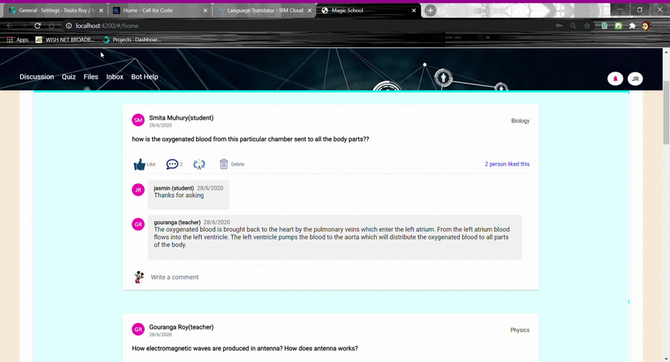
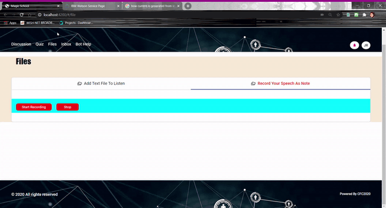
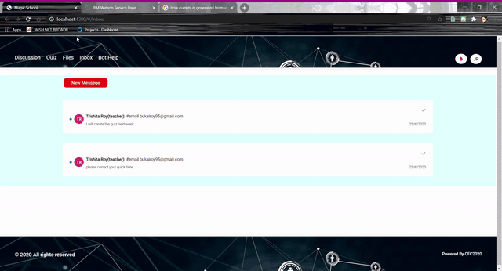
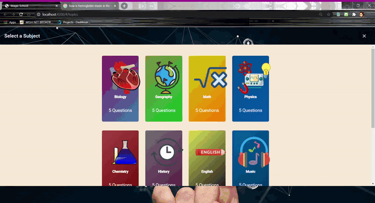
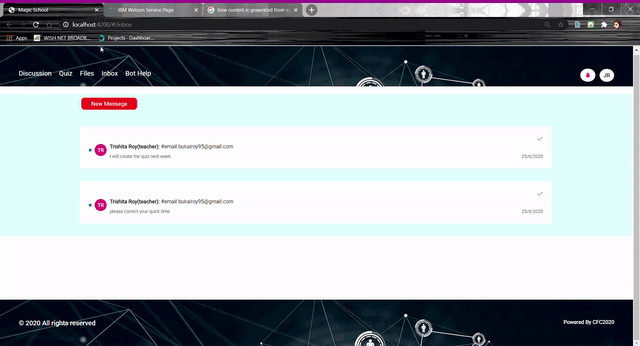

# CFC 2020 Hackathon - Remote Education

## Description
It is the year 2020 and students are experiencing a new way of life when it comes to getting an education. Students are realizing they need to adopt a proactive and self-service mindset in to fulfill their academic needs.This is a minor implementation of an online educational environment and useful tools that helps students and teachers to find and access learning content supports this new self-service model.

## Featured technologies
* [Angular](https://angular.io/guide/setup-local) :Front-end web app framework allowing application UI to be dynamic
* [Express Js/Loopback framework](https://loopback.io/doc/en/lb3/Installation.html): Highly-extensible, open-source Node. js framework that enables you to Create dynamic end-to-end  REST APIs with little coding. 
* [Watson Text to speech](https://cloud.ibm.com/catalog/services/text-to-speech) : You can generate human-like audio from written text. 
* [Watson Language Translator](https://cloud.ibm.com/catalog/services/language-translator) : The service allows users to translate text from one language to another.
* [Watson Assistant Education-AI-ChatBot](https://cloud.ibm.com/catalog/services/watson-assistant) : The service defines a dialog that a student and a course provider might experience as a student searches for learning content.Students can input grade-level and academic topics question, and the chatbot responds with course recommendations and learning content links. 
* [Ibm Cloud foundry](https://cloud.ibm.com/cloudfoundry/overview) : Create and deploy apps on IBM Cloud's multi-tenant Cloud Foundry enviroment available in 5 IBM Cloud Regions. 
* [IBM Cloud continous delivery of toolchain](https://cloud.ibm.com/services/continuous-delivery/crn%3Av1%3Abluemix%3Apublic%3Acontinuous-delivery%3Aeu-gb%3Aa%2Fd54a7808f74547e498188a99a26fac7a%3A2380b01a-970d-4e37-be8c-c76c034a61ad%3A%3A?paneId=manage) : This automate builds, unit tests, deployments, and more. Edit and push code using Git Repos and Issue Tracking and the rich web based IDE. Create toolchains to enable tool integrations that support your development, deployment, and operation tasks.

## Before Running this Project Download code and install dependency
## Steps

Follow these steps to setup and run this code pattern. The steps are described in detail below.

1. [Clone the Rep](#1-clone-the-repo)
2. [Set up the project in local](#2-set-up-the-project-in-local)

## 1. Clone the repo
```bash
git clone https://eu-gb.git.cloud.ibm.com/Trisita.Roy/magic-school-public.git
```
## 2. Set up the project in local
There are three folders under root directory 
1. [UI](http://localhost:4200)
2. [Server](http://localhost:3030/explorer)
3. [watsonservice](http://localhost:3000)

Install npm packages using 'npm install' command inside the terminals of all 3 Project Folders.
Run npm start in all of them.

Run following commands
```bash
npm install
npm start
```


## Flow

* Role Type : Teacher, Student

#### Module Description ######


## Login/Register
User need to register himself as a student/teacher with unique email and userid to access the application. If you register yourself as a teacher you must choose a subject in which you would like to get notified for queries raised by students.

## Discussion
In this section people can gather to have discussions about a specific topic.A person can create a discussion in one of the topics and also can notify a person to the discussion which will appear in Notification Bar. Then other people can reply on that topic or just like the discussion. Most important feature in this section is anyone can translate the discussion into diffrent language for better understanding and can reply to that topic with what they think about the context.

<br>
<p align="center">
  
</p>
<br>


## Files
In this section user can create or upload notes for everyone which is audible. Other users can translate the note to diffrent languages and leave comment to the post.

<br>
<p align="center"> 
  
</p>
<br>

## Educational Chat Bot
user searches for learning courses by giving input grade-level and academic topics question, and the chatbot responds with course recommendations and learning content.

<br>
<p align="center"> 
  
</p>
<br>

## Create/Take Quiz
A teacher can create quiz on diffrent topics for students.When students evaluate themselves,they are assessing what they know, do not know, and what they would like to know.
<br>
<p align="center"> 
  
</p>
<br>

## Inbox
In this section user can connect with each other. For example a student can send messege to a teacher to upload a new quiz.
<br>
<p align="center"> 
  
</p>
<br>

## My Profile
There are three co-section under Profile.
* Attendance Summary: It records total spent time and Idle hours spent on the application
* Quiz Performance : The assesment scores get logged in this section
* Contact Info : User can update contact info
<br>
<p align="center"> 
  
</p>
<br>
 

